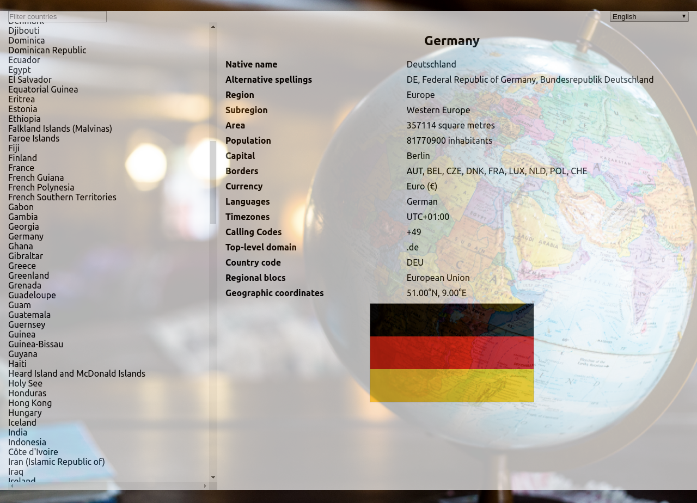

# Country DB

This webpage was created by Stefan Klinkusch at Digital Career Institute in Berlin, Germany, using React.js. It consumes the country data from the [restcountries API](https://restcountries.eu/rest/v2/all).

## Features

The page features
- a sidebar with a list of clickable countries in a selected language
- an input field to filter the list of countries using a search string
- a large info field printing out the information about the selected country
  - name in the selected language
  - name in the native language
  - a list of alternative spellings
  - region and subregion
  - area in m2
  - number of inhabitants
  - capital city
  - a list of bordering countries, abbreviated by their country codes
  - a list of currencies (name and symbol)
  - a list of languages used in the selected country
  - a list of time zones
  - a list of calling codes
  - a list of top level domains
  - the three-letter country code
  - a list of regional blocs of which the country is a member
  - the geographical coordinates
  - the flag of the country
- a dropdown menu to change the language of the country names:
  - English (default)
  - Brazilian Portuguese
  - Croatian
  - Dutch
  - Farsi
  - French
  - German
  - Italian
  - Japanese
  - Portuguese (European)
  - Spanish

## Screenshot

## Task

Today we create a small country explorer.
With the help of https://restcountries.eu/ API

## Preview

## Tasks

- Create a views according to the preview image
- Use Context to show country detail view
- Make the list of countries searchable
- Create a language selector to show proper country names
